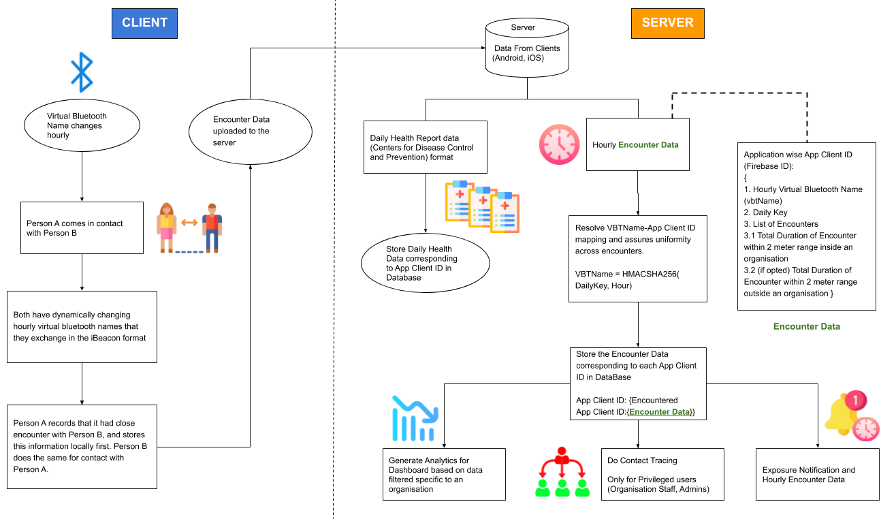
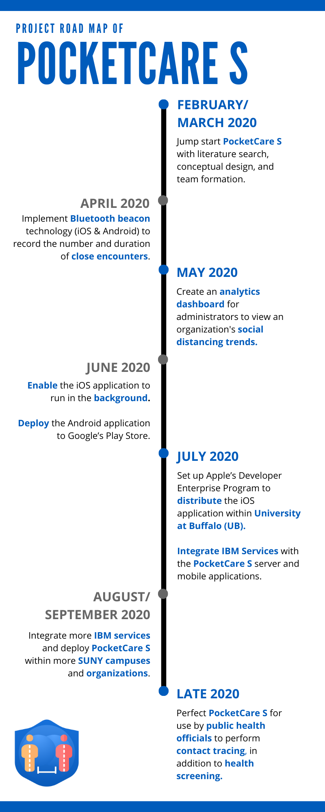

# PocketCare S - iOS

<p align="center">

</p>

**Call for Code submission for COVID-19 track.**

PocketCare S is a comprehensive smartphone-based solution for monitoring close encounters. It is a bluetooth low energy (BLE) based solution which enables smartphones to send and receive anonymous beacon signals. It checks the distance between a smartphone and another beacon (or smartphone running PocketCare S) to see if they are close to each other (less than 2m). If so, the smartphone records the duration of such a close encounter with another beacon. 

PocketCare S is designed to report social distance information without collecting or revealing any personally identifiable information about any specific individual.


## Contents 
1. [Demo Video](#demo-video) 
2. [The Architecture](#the-architecture)
3. [Getting Started](#getting-started)
4. [How does PocketCare S Work?](#how-does-pocketcare-s-work)
5. [Push Notifications for Exposure](#push-notifications-for-exposure)
6. [Built With](#built-with)
7. [Project Road Map](#project-road-map)
8. [Additional Information](#additional-information)
9. [License](#license)
10. [Acknowledgments](#acknowledgements)

## Demo Video 

[](https://youtu.be/JUTQIcdgXwc "PocketCare S Demo")
 
## The Architecture


## Getting Started 

**Due to simulators not supporting Bluetooth, close encounter detection will not work on simulators.**

### Prerequisites

Before you begin, make sure you satisfy the following requirements:
1. You are running the project on a physical iPhone.
2. The iPhone should be running iOS 13 or later.

### Installing PocketCare S using Xcode

To install PocketCare S on your iPhone, follow these steps:
1. Connect iPhone to your Mac using USB cable
2. Open PocketCare S using Xcode
3. Ensure Deployment Info > Target = iOS 13.0
4. The application is already configured with the IBM server URL. If you want to run server on your local machine, follow the PocketCareS-Server setup documentation and replace the **hostURL** variable in [Constants.swift](https://github.com/PocketCareS/PocketCareS-iOS/blob/master/PocketCare+/Extensions/Constants.swift) file with your URL. 

``` swift
    static let hostURL = "YOUR_SERVER_URL"
```

5. Click Run 

## How does PocketCare S Work?

### Key Highlights (Mobile Application)

1. Close encounter data will be displayed in the mobile application after a close encounter session starts. A close encounter session starts when two people are within **2 meters** for at least **5 minutes**. 
2. The **virtual bluetooth name** changes every hour to ensure **user privacy**. 
3. Data upload to the server takes place every hour.
4. Data is stored in user's phone for a maximum of 14 days. 

### Detailed Architecture 



### Technological Advances

PocketCare S has made significant technological advances compared to other solutions. An Infographic with this information can be found [here](https://engineering.buffalo.edu/content/dam/engineering/computer-science-engineering/images/pocketcare/PocketCareS-TechAdvances.pdf).

### Security and Privacy 

PocketCare S cares values the security and privacy of its users. The app does not collect any private information about an individual person.  All the data collected is anonymous and will not reveal any personally identifiable information. An Infographic with this information can be found [here](https://engineering.buffalo.edu/content/dam/engineering/computer-science-engineering/images/pocketcare/PocketCareS.pdf).

## Push Notifications for Exposure

PocketCare S plans to implement automatic contact tracing by collaborating with healthcare organizations in the future. The iOS version of PocketCare S supports Push Notification, but in this particular demo we don't showcase it. 


**For a more detailed description, refer to the [additional information](#additional-information) section.**


## Built With 

In this submission, we have used IBM’s Cloud **Red Hat OpenShift** to deploy our server (using **OpenJDK 8**), database (using **MongoDB**), the web portal (using **Node JS server**) and **IBM Push Notification Service** from **IBM Cloud** in the Android application of PocketCare S as a proof of concept. In the future, we plan on integrating other IBM services into the PocketCare S solution.

## Project Road Map 



## Additional Information 

You can read more about PocketCare S on our [website](https://engineering.buffalo.edu/computer-science-engineering/pocketcares.html). We also have a [White Paper](https://docs.google.com/document/d/e/2PACX-1vT6UqA3HByzG5Di576gmz-JWzgKOFx5KLYGgJMpxcmWkOXYJ_vUFz2h1w2LnDNWI4y-xnyKhPi_s70p/pub) which can be accessed here.  

PocketCare S is also available on [Google Play](https://play.google.com/store/apps/details?id=com.ub.pocketcares) and to the University at Buffalo (UB) community using the [Apple Developer Enterprise Program](https://engineering.buffalo.edu/computer-science-engineering/pocketcares/pocketcares-ios.html).

## License 

This project is licensed under the Apache 2 License - see the [LICENSE](LICENSE) file for details.

## Acknowledgements

Special thanks to all who helped bring the project to fruition:

Sourav Samanta, Rishabh Joshi, Jeetendra Gan, Shanelle Ileto, Aritra Paul, Dr. Peter Winkelstein, Dr. Matthew R. Bonner, Kevin Wang, Chen Yuan, Dheeraj Bhatia, Latheeshwarraj Mohanraj, Dr. Wen Dong, Dr. Tong Guan, Dr. Marina Blanton, Sasha Shapiro, Stephen Fung

And our deepest gratitude for the support of **University at Buffalo**.
